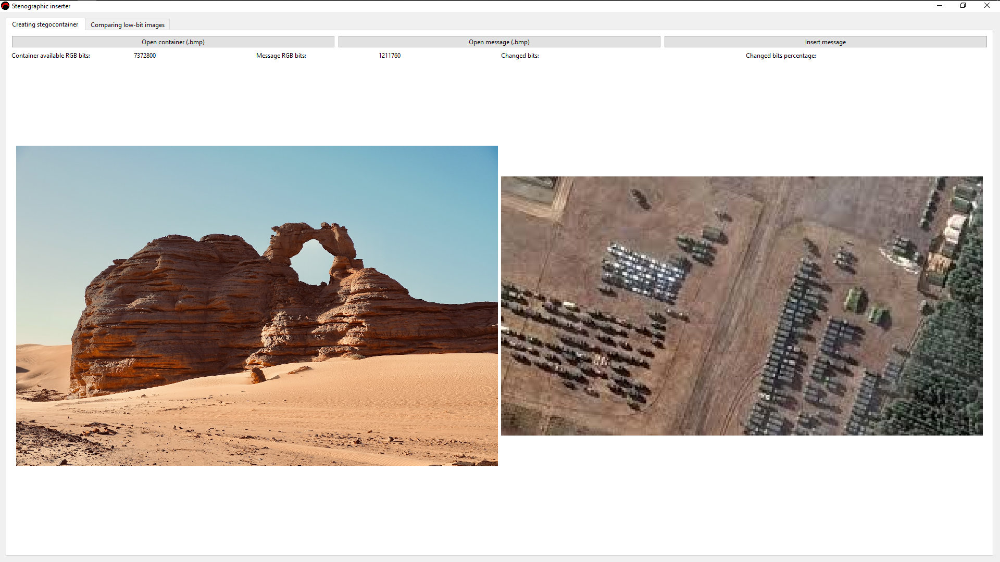
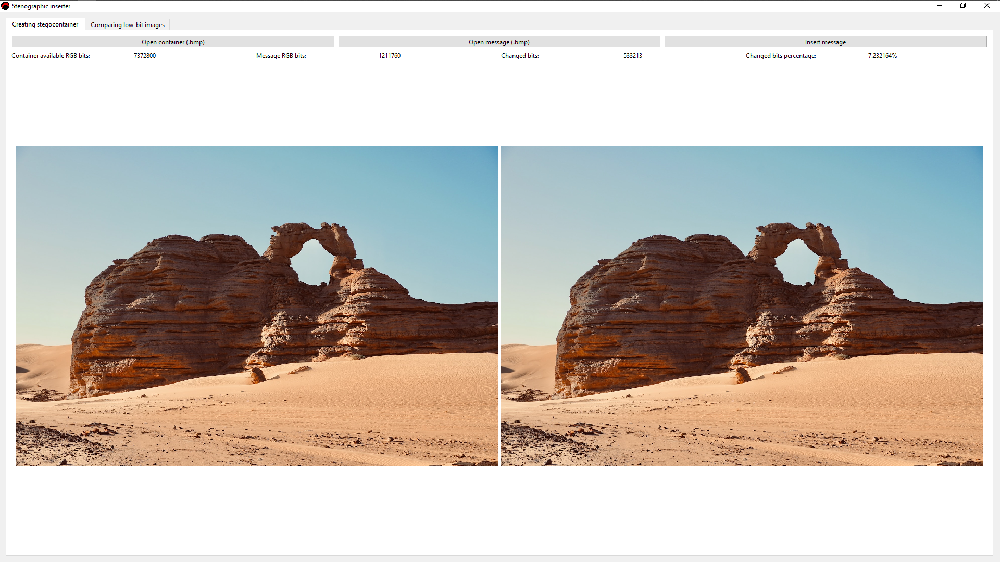
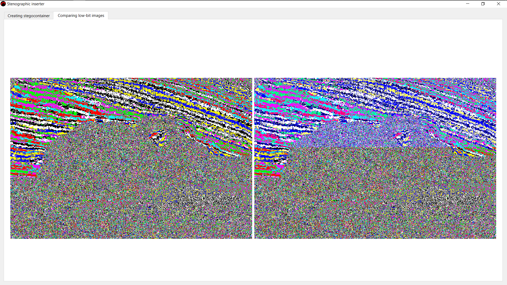

# Steganographic Inserter
## Used Technologies & Software
- GUI framework: [***Qt***](https://www.qt.io/ "Visit Qt framework webpage")
- External library: [***EasyBMP***](https://easybmp.sourceforge.net/ "Visit library webpage")
- CMake
- QMake
- CLion 2022.2
## Project Properies & Structure
Project is used to insert bmp-pictures into another bmp-container secretly. Program sequentially writes bits of R, G and B component of the secret message into low bits of B, R and G component of the container. Program calculates the quantity of available bits in the RGB layers of the container, quantity of RGB bits of the message and number with percentage of changed bits while inserting as the user uses the program. Project has both console and GUI version of the program.

The project structure is Object Oriented, so it has ***InserterBMP*** class with its' definition and implementation in header and .cpp files of the same name.

Project already has downloaded and unarchived EasyBMP library without example project for lighter project size.

## GUI Appearance

GUI of the program is fullscreen fixed size window with 2 tabs.
### Tabs:
1. ***Creating Stegocontainer*** is tab with basic functional for creating stegocontainer, some values which characterize container, message and stegocontainer are provided in this tab too
2. ***Comparing low-bit images*** is tab with low bit pictures of container and stegocontainer that are put next to each other

***Creating Stegocontainer*** tab has 3 functional buttons, 2 picture labels and 4 labels with important values.

### Buttons:
1. ***Open container (.bmp)*** button calls a dialog menu in file explorer to choose container, when container is chosen picture is put into left picture label. In addition, this button also creates low bit image of the container and puts it into left picture label in the ***Low bit pictures comparison*** tab
2. ***Open message (.bmp)*** button also calls similar dialog menu and puts selected picture into the right picture label, after that it makes binary file with all RGB bits, which will be used for insertion
3. ***Insert message*** button isn't active until the message and container are selected, otherwise button is clickable and after click message picture changes to stegocontainer picture. After all it creates low bit image of the stegocontainer and inserts it into right image label in the ***Low bit pictures comparison*** tab

### Value Labels:
1. ***Container available RGB bits*** shows how many container bits of RGB pixels can be used for writing the message RGB
2. ***Message RGB bits*** shows quantity of message bits in RGB pixels
3. ***Changed bits*** displays number of changed bits while inserting message binary file 
4. ***Changed bits percentage*** displays percentage of changed bits in container availiable RGB bits

***Comparing low-bit images*** tab has only 2 picture labels of low bit container and stegocontainer, left for container and right for stegocontainer.

## Installation & Running
1. [***Download ZIP Archive***](https://github.com/kuksarnlav/stenographic_inserter/archive/refs/heads/main.zip "Download stenographic inserter") of the project
2. Unpack the archive into your folder destination
### Console program
Current instruction is about installation and running the program in CLion IDE.

3. Open stenographic_inserter_backend folder via CLion
4. Click OK in Open Project Wizard window
5. After that actions you would be able to run project as usual (don't forget to enter your own .bmp files' paths in main.cpp of backend project, otherwise error will happen)

### GUI program
Current instruction is about installation and running the program in Qt Creator.

3. Open stenographic_inserter.pro file via Qt Creator
4. Choose Desktop Qt 6.8.0 MinGW 64-bit compiler in ***Configure Project*** section, click ***Configure Project***
5. After that actions you would be able to run project as usual

### App

3. Double click ***stenographic_inserter.exe*** in ***stenographic_inserter_app*** folder
